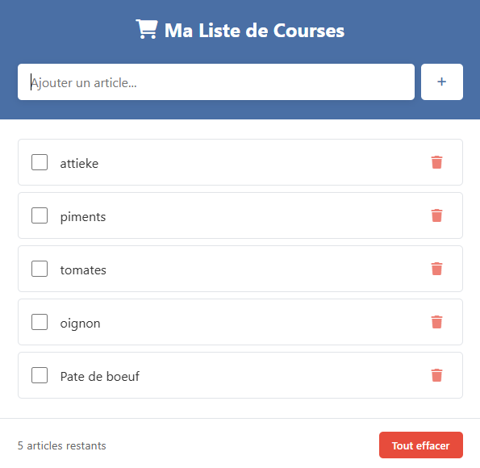

# shopping_list

## Description
Application web simple permettant de créer et gérer une liste de courses.  
L’utilisateur peut ajouter, modifier l’état et supprimer des produits, avec une sauvegarde automatique dans le navigateur grâce au **localStorage**.  
Ce projet est le **sixième** du défi personnel **100 projets en 2026**.

---

## Objectifs du projet
- Implémenter un CRUD complet côté front
- Utiliser le stockage local du navigateur
- Manipuler le DOM de manière dynamique
- Concevoir une interface simple et efficace

---

## Plateforme
- Web (navigateur)

---

## Technologies utilisées
- HTML
- CSS
- JavaScript
- localStorage

---

## Fonctionnalités
- Ajouter un produit
- Marquer un produit comme acheté
- Supprimer un produit
- Sauvegarde automatique des données
- Restauration des données au rechargement

---

## Design & UX
- Interface claire et pratique
- Design responsive 
- Navigation simple et rapide
- Boutons accessibles et lisibles

---

## Captures d’écran

---

## Ce que j’ai appris
- Gestion du CRUD en JavaScript
- Manipulation du localStorage
- Mise à jour dynamique du DOM
- Structuration d’une petite application web

---

## Améliorations possibles
- Catégories de produits
- Tri automatique
- Mode sombre
- Partage de liste

---

## Statut du projet
 **Projet terminé**
